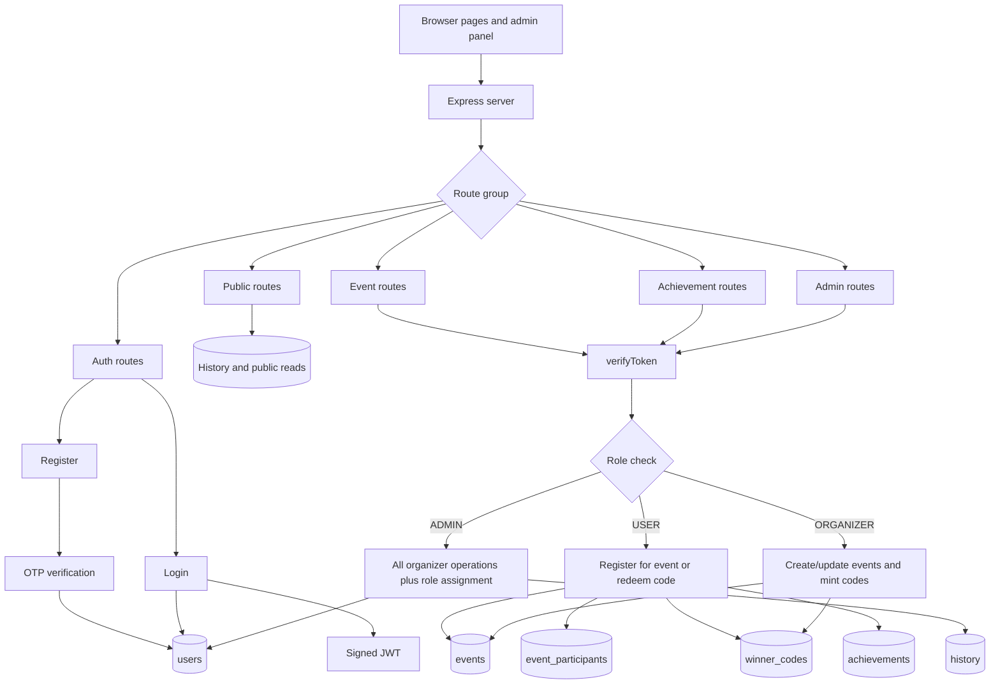
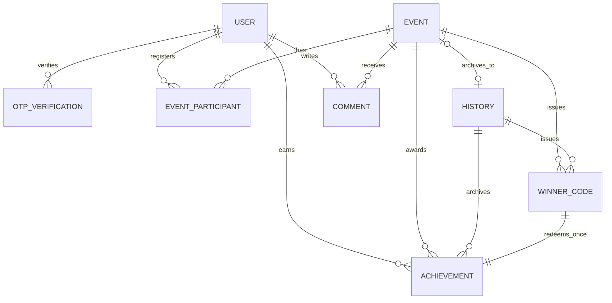

# Authorization and Database Flow

## Runtime Request Flow



## Who Can Update What

| Operation | Anonymous | USER | ORGANIZER | ADMIN | Database writes |
|---|---:|---:|---:|---:|---|
| Read active events | Yes | Yes | Yes | Yes | None |
| Read public history | Yes | Yes | Yes | Yes | None |
| Login | Yes | Yes | Yes | Yes | None |
| Register and verify OTP | Yes | Yes | Yes | Yes | `users` |
| Register for an event | No | Yes | Yes | Yes | `event_participants` |
| Redeem a winner code | No | Yes | Yes | Yes | `winner_codes`, `achievements` |
| Create an event | No | No | Yes | Yes | `events` |
| Update an event | No | No | Yes | Yes | `events` |
| Generate winner codes | No | No | Yes | Yes | `winner_codes` |
| Archive an event | No | No | Yes | Yes | `history`, `achievements`, `winner_codes`, then deletes `events` |
| Create history directly | No | No | Yes | Yes | `history` |
| Update all history fields | No | No | Yes | Yes | `history` |
| Delete history | No | No | Yes | Yes | `history` and cascading relations |
| Assign a role | No | No | No | Yes | `users.role` |

The UI may hide controls, but the backend middleware is the authority. A forged or stale browser value must never grant access.

## Route Guard Layout

```mermaid
flowchart LR
    Request[Request] --> AuthRouter[/api/auth]
    Request --> EventRouter[/api/events]
    Request --> AchievementRouter[/api/achievements]
    Request --> AdminRouter[/api/admin]

    AuthRouter --> PublicAuth[login, register, verify-otp]
    EventRouter --> PublicEvents[GET events]
    EventRouter --> Token1[verifyToken]
    Token1 --> Role1[requireRole USER/ORGANIZER/ADMIN]
    AchievementRouter --> Token2[verifyToken for redeem]
    AdminRouter --> Token3[verifyToken]
    Token3 --> Role3[requireRole ORGANIZER/ADMIN]
    Role3 --> AdminOnly[requireRole ADMIN for assign-role]
```

## Database Relationships



### Important invariants

- `User.email` and `User.username` are unique.
- An event/user pair can occur only once because of `EventParticipant @@unique([eventId, userId])`.
- A winner code hash is unique and an achievement can use a winner code only once.
- A winner code belongs to exactly one target in application logic: `eventId` or `historyId`.
- An archived event currently relinks its achievements and winner codes to history before deleting the event.
- `onDelete: Cascade` can remove participants, winner codes, comments, or achievements. Test destructive operations only on a disposable database.

## Stress Test Usage

Start the backend locally, then run:

```text
node scripts/stress-test.mjs --base-url http://localhost:5000 --concurrency 10 --requests 100
```

The default run is read-only plus unauthorized-access checks. It does not create users, events, codes, or history.

For checks using existing tokens:

```text
$env:USER_TOKEN = "..."
$env:ORGANIZER_TOKEN = "..."
$env:ADMIN_TOKEN = "..."
node scripts/stress-test.mjs --concurrency 10 --requests 100
```

Only use mutation mode against a disposable staging database:

```text
node scripts/stress-test.mjs --mutate --base-url http://localhost:5000
```

The script reports request counts, failures, status counts, p50/p95/p99 latency, and timeout counts. It exits non-zero when an expected authorization result fails.

## Known Flow Risks To Test

- Event archive currently performs several writes without one database transaction; a failure between writes can leave partial archive state.
- OTP state is currently held in process memory rather than the `otp_verifications` table; multiple instances and restarts do not share pending OTPs.
- `GET /api/achievements/user/:userId` is currently public and should be treated as a privacy/authorization test case.
- The admin page performs HTML interpolation; load tests do not detect stored XSS, so safe DOM rendering needs a separate browser security test.
